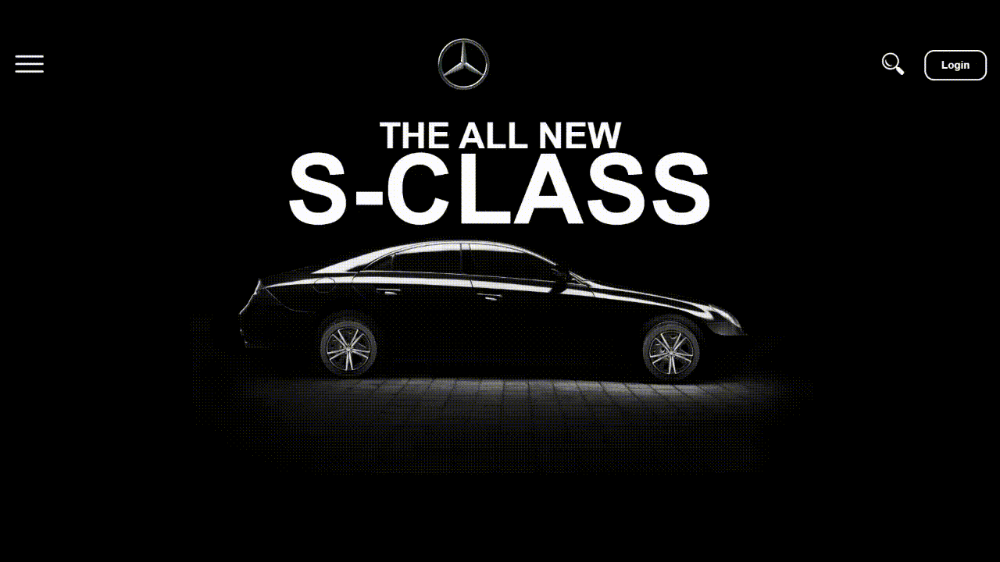

# 🚗 Car Animation Project

This is a simple **car animation project** built using **HTML and CSS**. The animation features a moving car with spinning wheels and a navigation bar with interactive buttons.

## 📸 Showcase

  


## ✨ Features
- 🚘 **Animated Car Movement** – The car smoothly drives into the center of the screen.
- 🏁 **Spinning Wheels** – The wheels rotate as the car moves.
- 📌 **Navigation Bar** – Includes a **menu button, search button, and login button**.
- 📱 **Responsive Design** – Adapts to different screen sizes for a seamless experience.

## 🛠️ Technologies Used
- **HTML**
- **CSS**

## 🚀 Installation & Usage
1. **Clone the repository** or **download the project files**:
   ```sh
   git clone https://github.com/yourusername/car-animation.git

Open home.html in any modern web browser.
The animation will start automatically when the page loads.


## 🔮 Future Improvements  
- ✨ **Add JavaScript functionality** for interactive buttons.  
- 🎭 **Improve animations** with smoother transitions.  
- 📱 **Enhance responsiveness** for better mobile support.  

